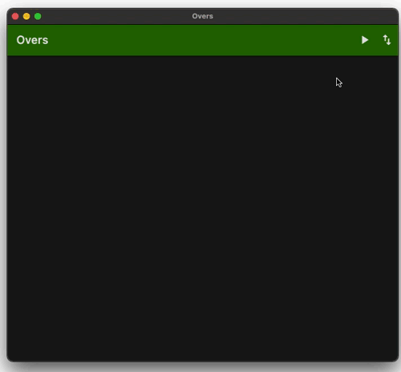

# Overs
Multi-platform application for detecting potential over 2.5 goals footbal fixtures

## Table of contents
* [General info](#general-info)
* [Usage](#usage)
* [Components](#components)
* [Technologies](#technologies)
* [Setup](#setup)
* [Features](#features)
* [Status](#status)
* [Licence](#licence)
* [Contact](#contact)

## General info

Multi-platform application for detecting potential over 2.5 goals footbal fixtures

Runs on Android, macOS and iOS.

Implemented using Provider pattern.

## Usage
### Detect potential over 2.5 goals footbal fixtures

## Technologies
* Flutter 2.8.1
* Dart 2.15.1
* [Provider](https://pub.dev/packages/provider)

## Setup
To run this project make sure you have installed:
* [Flutter](https://docs.flutter.dev/get-started/install)
* [Android Studio](https://docs.flutter.dev/get-started/editor?tab=androidstudio) or [VS Code](https://docs.flutter.dev/get-started/editor?tab=vscode)

## Features

* Detect potential over 2.5 goals footbal fixtures
* Export fixtures to text file

To-do list:
* Bugfixes

## Status
Project is in progress.

## Licence

This project is licensed under the GNU GPL v3 License - see the [LICENSE.md](https://github.com/NikolaGrujic91/garden_planner_app/blob/main/LICENSE) file for details.

## Contact
Created by Nikola Grujic - feel free to contact me!

grujic.nikola91@gmail.com

[Nikola Grujic | LinkedIn](https://www.linkedin.com/in/nikola-grujic-735a7284/)

